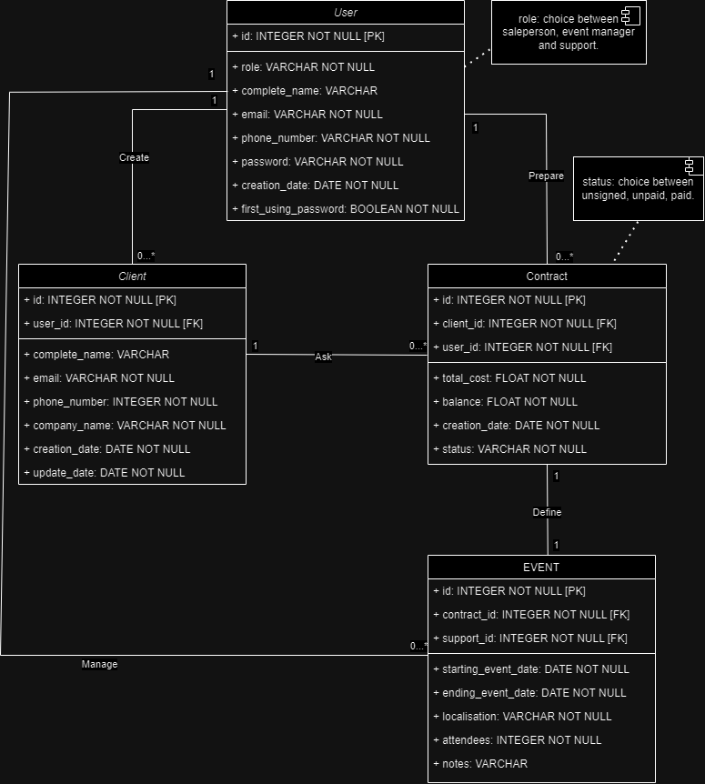

# Epic_Events


A CRM Python project. 

## Table of Contents
- [Installation](#installation)
- [Database-plan] (#Database-plan)
- [Contributing](#contributing)
- [License](#license)

## Installation

1. Clone the repository:  
```bash
git clone https://github.com/DarkExplorer31/Epic_Events
```
2. Create a virtual environment and activate it:
```bash
python -m venv venv
```
if you use Windows:
```bash
env\Scripts\activate
```
on Mac or Linux:
```bash
source venv/bin/activate
```
3. Install dependencies:
```bash
pip install -r requirements.txt
```
## Database Plan


## Contributing
If you'd like to contribute to this project, please follow these guidelines:

1. Fork the project on GitHub.
2. Create a new branch with a descriptive name.
3. Commit your changes and push your branch to your fork.
4. Open a pull request to the main repository.

[Back to table of content](#table-of-contents)

## License
Distributed under the MIT License. See LICENSE.txt for more information.
[Back to table of content](#table-of-contents)